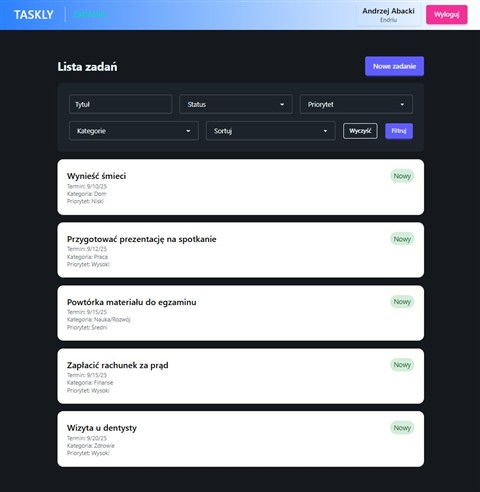
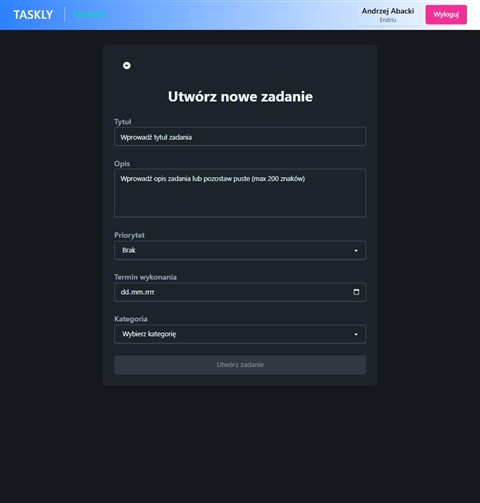

# Taskly - **Task Manager**

---

## Spis treści
- [Funkcjonalności](#funkcjonalności)
- [Technologie](#technologie)
- [Architektura](#architektura)
- [Widoki](#widoki)
- [Uruchamianie](#uruchamianie)
- [API](#api)

---

## Funkcjonalności

- **Rejestracja / logowanie** (JWT)
- **Zadania (Tasks)**: lista, filtracja, szczegóły, tworzenie, edycja, usuwanie
- **Ochrona tras**: authGuard + interceptor JWT
- **Powiadomienia UI**: proste toasty

---

## Technologie

**Frontend**
- Angular
- Tailwind CSS + DaisyUI

**Backend**
- .NET **9** / ASP.NET Core
- Onion Architecture: **API** / **Application** / **Domain** / **Infrastructure**
- EF Core + PostgreSQL
- **JWT** (autentykacja), **BCrypt** (hasła), **AutoMapper**

---

## Architektura

```
Taskly
├─ Frontend/
│  └─ client/                
│      ├─ src/app/           # App config, app routes
│      ├─ src/core/          # guards, interceptors, services
│      ├─ src/environments/  # environment.ts / environment.development.ts
|      ├─ src/shared/        # typy, enumy
|      ├─ src/layout/        # navbar
|      └─ src/features/      # foldery z poszczególnymi widokami
│
└─ Backend/
   ├─ API/                   # Kontrolery, konfiguracja, instalatory
   ├─ Application/           # DTO, interfejsy, serwisy domenowe, mapowania
   ├─ Domain/                # encje i enumy
   ├─ Infrastructure/        # EF Core DbContext, repozytoria, migracje
   └─ Taskly.Tests/          # Testy xUnit
```

---

## Widoki

<div align="center">

| Lista zadań |   | Dodawanie zadania |
|-------------|---|-------------------|
|  |   |  |

</div>

---

## Uruchamianie

### 1) Backend
```bash
cd Backend
dotnet dev-certs https --trust
dotnet restore
dotnet ef database update --project Infrastructure --startup-project API
dotnet run --project API              # API: https://localhost:5001 (domyślnie)
```

### 2) Frontend
```bash
cd Frontend/client
ng serve                              # FE: http://localhost:4200
```

---

## API

- **`AuthController`**
  - `POST /api/auth/register` – rejestracja użytkownika
  - `POST /api/auth/login` – logowanie, zwraca token JWT
    
- **`UsersController`** (wymaga autoryzacji)
  - `GET /api/users/me` – dane bieżącego użytkownika
  - `PUT /api/users/me` – aktualizacja danych bieżącego użytkownika
  - `DELETE /api/users/me` – usunięcie konta
    
- **`TasksController`** (wymaga autoryzacji)
  - `GET /api/tasks` – lista zadań (opcjonalnie filtr parametrami)
  - `GET /api/tasks/{id}` – szczegóły
  - `POST /api/tasks` – utworzenie
  - `PUT /api/tasks/{id}` – edycja
  - `DELETE /api/tasks/{id}` – usunięcie
    
- **`CategoryController`**
  - `GET /api/category` – lista kategorii
